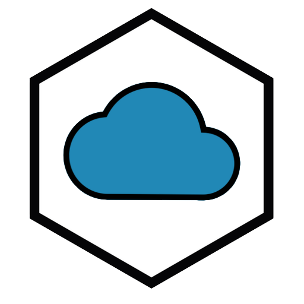

# node-distribute
> node ☁️

[](https://www.npmjs.com/package/node-distribute)
[](https://david-dm.org/gabrielcsapo/node-distribute)
[](https://david-dm.org/gabrielcsapo/node-distribute#info=devDependencies)
[](https://travis-ci.org/gabrielcsapo/node-distribute)
[](https://coveralls.io/github/gabrielcsapo/node-distribute?branch=master)




# What is this

`node-distribute` is an easy way to deploy node applications to a single service provider.

Simply add a `distribute.json` file to your repository specifying your startup information and push to the remote server `node-distribute` is running on.

# Usage

```javascript
{
    "name": String, // The subdomain of the application, if the name is * it denotes default path
    "script" : String, // The relative path to the script to start the application
    "type": String, // (optional) Default is NODE, this can also be static
    "directory": String, // (optional) the directory to serve static files from
    "instances" : Number // The number of instances
}
```

# More

To learn more visit [http://www.gabrielcsapo.com/node-distribute/](http://www.gabrielcsapo.com/node-distribute/)
